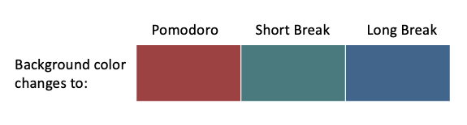

# custom-productive-google-calendar
An Arc Browser Boost for Google Calendar.  

## What This is 
This Arc Boost is aimed at students and those who need a means that allows them to customize their Gooogle Calendar and make it more productive than ever. - *whether it's for studying or running errands, Productive Google Calendar is there for you.* 

## Key Features   
🗓️ Customize your Google Calendar background with any image of your choice.

🍅 Set up [Pomodoro](https://francescocirillo.com/products/the-pomodoro-technique) timers in a click so that you can work in 25 minutes intervals throughout the day.



## Setup
1. Create a boost - select the "Inject" template. 
2. Select "A specific website", enter calendar.google.com and click "Create Boost".
2. Copy and paste the code under `content.js`.
3. Create a Content Stylesheet and copy and paste everything under `styles.css`.

## Usage
### Customize Your Google Calendar Background
In `content.js`, modify the `defaultImage` variable to a Google Drive image link of your choice.

```
// set default background here 
let defaultImage = "Your Drive Link"
```

### Set up Pomodoro Sessions
Click on the red clock icon on the top of the page to begin a 25 minute Pomodoro session.

- After a 25 minute Pomodoro session, there is a 5 minute short break. 
- After every 4 Pomorodo sessions, there is a 15 minute long break.

## Why I Created Productive Google Calendar 
### The Customizability Aspect 
As much as I like the features in Google Calendar, I really do not like the way it looks right now - the permanent 'Light Mode' look. As a 'Dark Mode' person, having one of my screens emitting invasively glaring white light is painful and distracting.

It is clear that Google Calendar needs more customizability,especially in terms of a more customizable background. 

The benefits of a customizable background are immense. For example, I could set the background to something that is less 'Light Mode'. Others facing a similar issue as me, or simply want to have a fresh look on Google Calendar could also benefit with increased customizability in Google Calendar.

### The Productivity Aspect 
Productivity tools like Google Calendar have been instrumental in helping me be on task and focus on the things that are important in life. 

However, a fundamental problem is that Google Calendar itself merely gives me a tool to do time-blocking - it doesn't really help me be productive, that is, following my planned schedule and being on task. I could plan out my entire day but not follow through it at all. For example, I could be distracted by Youtube or TikTok all day.

The Pomodoro technique helps me overcome this problem. The 25 minute work sessions encourage me to focus and be less distracted. With this technique, I am able to follow my Google Calendar schedule and get things done.

>Time-blocking + Focus sessions = Peak Productivity 🤯

Therefore, I decided to take back my internet and supercharge my productivity, by creating a Productive Google Calendar that combines existing time-blocking features with focus session features. 


